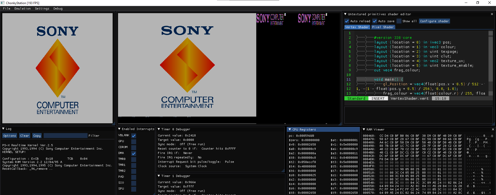

# ChonkyStation
 

ChonkyStation is a PlayStation 1 emulator.
As of now it can only run some homebrew programs, no commercial game works yet.

# What is implemented, at least partially
- CPU (Working on the GTE)
- DMA Channels 2, 3, 6
- GPU (OpenGL renderer)
- CDROM
# What isn't
- SPU
- MDEC
- Timers
- SIO
- Pads, memory cards

# Thank you pesca btw
https://github.com/wheremyfoodat