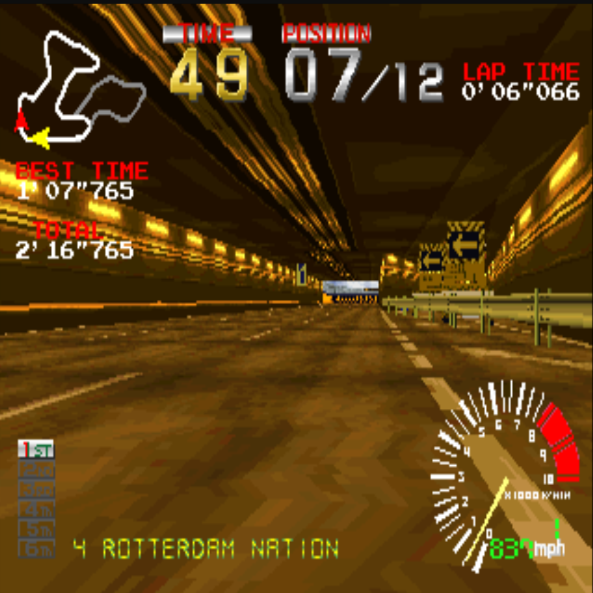
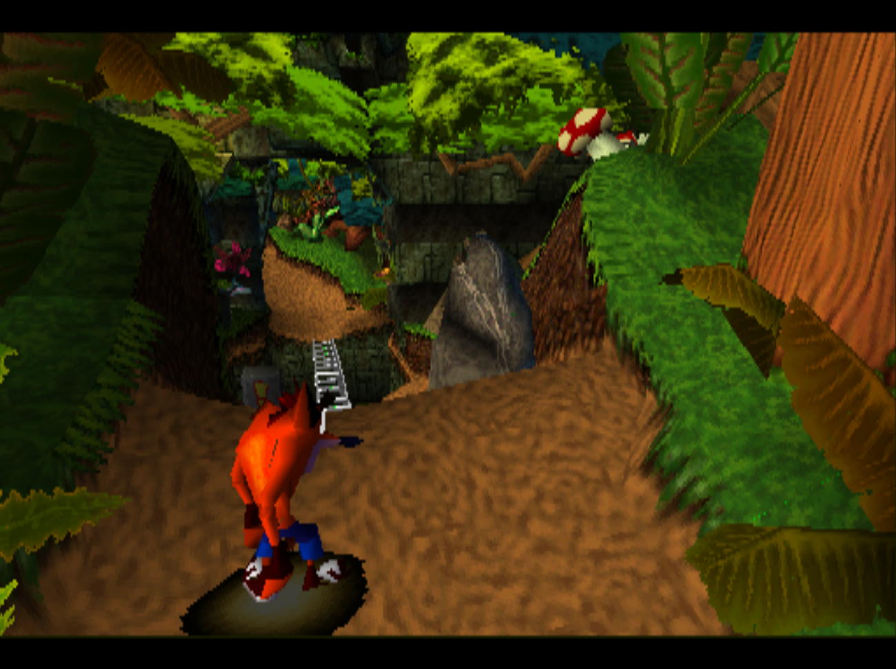

 
<h1 align="center">
ChonkyStation
</h1>

  <strong>A PlayStation 1 emulator</strong>

The PlayStation, often abbreviated as PS1 or PSX, is a video game console released by Sony Computer Entertainment.

# What is implemented, at least partially
- CPU (Working on the GTE)
- DMA
- GPU (OpenGL renderer)
- CDROM
- Timers
- Pads
- Memory cards
- MDEC
# What isn't
- SPU

<h1 align="center">
Some screenshots
</h1>

# Thank you peach
[@wheremyfoodat](https://github.com/wheremyfoodat)
